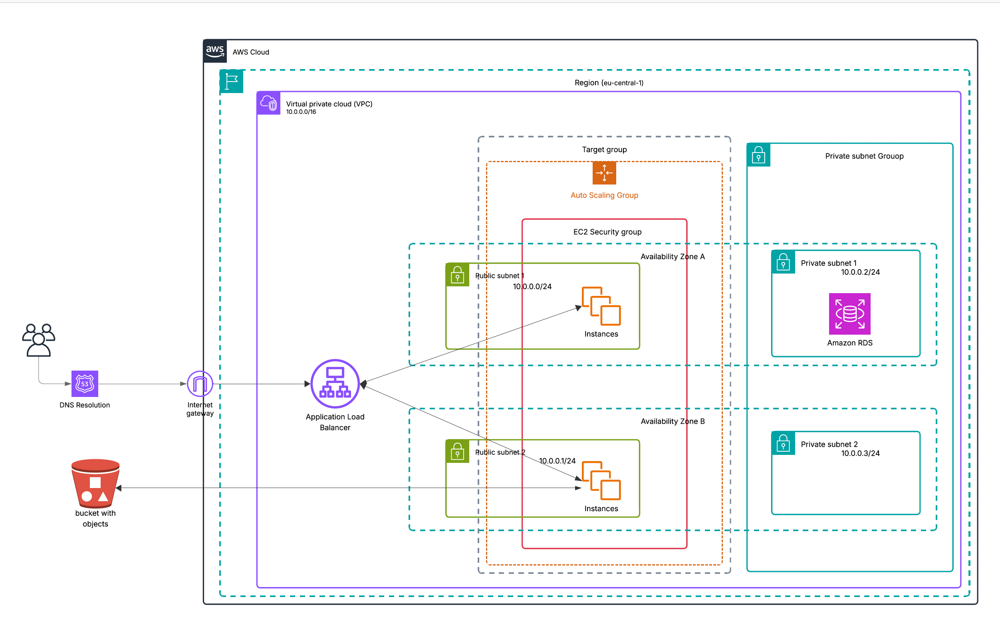
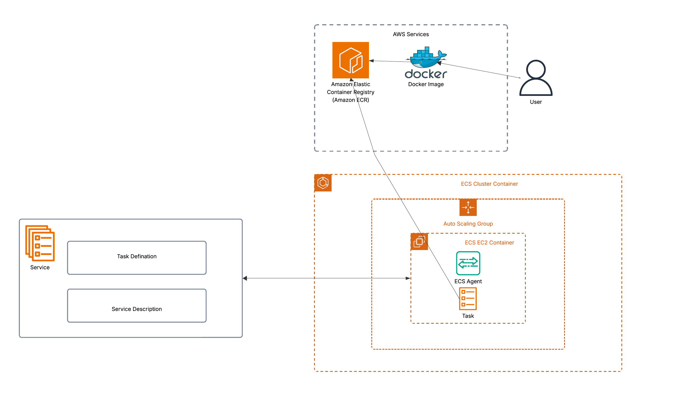

<!-- PROJECT BADGES -->
[](https://www.terraform.io/)
[](LICENSE)

# AWS Grocery Infra

> Terraform-managed AWS infrastructure for the Grocery App  
> Includes backend API and frontend web app

### 🎥 [Watch - Introduction](https://www.youtube.com/watch?v=inNKmnGBUtw)

---

## 📖 Table of Contents

1. [Overview](#%EF%B8%8F-overview)  
2. [Architecture](#-architecture)
3. [Prerequisites](#-prerequisites)
4. [Getting Started](#-getting-started)
5. [Terraform Configuration](#-terraform-configuration)
6. [Terraform Module](#-terraform-module)
7. [Deployment Guide](#-deployment-guide)
8. [AWS Console Tour and Web Application Demonstration](#-aws-console-tour-and-web-application-demonstration)  

---

## ⚙️ Overview

This project is part of the Cloud Track in our Masterschool Software Engineering bootcamp. Originally developed by our Track Mentor, Alejandro Román, my task was to design and deploy its AWS infrastructure step by step.

---

## 🏗 Architecture

### 🎥 [Watch - Architecture](https://www.youtube.com/watch?v=SVeOB3N6G3Y&t=5s)





---

## 🔧 Prerequisites
Terraform ≥ 1.0.0

AWS CLI

Docker (for local backend builds)

### 🎥 [Watch - Prerequisites](https://www.youtube.com/watch?v=Radpgqt2tQQ)

---
## 🚀 Getting Started

1. Clone the repository
2. Set up Terraform remote state
3. Configure AWS credentials
4. Set up Docker with ECR

### 🎥 [Watch - Getting Started](https://www.youtube.com/watch?v=ALv_n0ZYWls)
---

## 🚀 Terraform Configuration

### 🎥 [Watch - Terraform Configuration](https://www.youtube.com/watch?v=lEQGhs9nwvI)

```bash
infrastructure
├── scripts
├── environments
│   ├── prod
│   ├── staging
│   └── dev
│       ├── backend.tf
│       ├── terraform.tfvars
│       ├── variables.tf
│       ├── terraform.tfstate.backup
│       ├── terraform.tfstate
│       └── main.tf
├── modules
│   ├── rds
│   │   ├── outputs.tf
│   │   ├── variables.tf
│   │   ├── main.tf
│   │   └── README.md
│   ├── alb
│   │   ├── outputs.tf
│   │   ├── ec2-security-group.tf
│   │   ├── internet-gateway.tf
│   │   ├── route-table.tf
│   │   ├── listener.tf
│   │   ├── rds-security-group.tf
│   │   ├── alb-security-group.tf
│   │   ├── variables.tf
│   │   ├── main.tf
│   │   └── README.md
│   ├── vpc
│   │   ├── variables.tf
│   │   ├── outputs.tf
│   │   ├── public.tf
│   │   ├── private.tf
│   │   ├── main.tf
│   │   └── README.md
│   ├── ecs-cluster
│   │   ├── outputs.tf
│   │   ├── lb-listener.tf
│   │   ├── main.tf
│   │   ├── launch-template.tf
│   │   ├── ecs-service.tf
│   │   ├── auto-scaling-group.tf
│   │   ├── variables.tf
│   │   ├── task-definition.tf
│   │   └── README.md
│   └── s3
│       ├── variables.tf
│       ├── outputs.tf
│       ├── main.tf
│       └── README.md
└── global
    ├── providers.tf
    ├── versions.tf
    ├── backend.tf
    ├── outputs.tf
    ├── variables.tf
    ├── iam.tf
    └── README.md
```
---

## 🚀 Terraform Module

### 1. [VPC Module](https://github.com/jdedios-de/AWS_grocery/tree/version2/infrastructure/modules/vpc)
#### This Terraform module creates an AWS Virtual Private Cloud (VPC) with a specified CIDR block, along with public and private subnets distributed across availability zones.

### 2. [ALB Module](https://github.com/jdedios-de/AWS_grocery/tree/version2/infrastructure/modules/alb)
#### This Terraform module creates an AWS Application Load Balancer (ALB) along with associated security groups, internet gateway, route table, listener, and target group.

### 3. [ECS Cluster Module](https://github.com/jdedios-de/AWS_grocery/tree/version2/infrastructure/modules/ecs-cluster)
#### This Terraform module creates an AWS ECS (Elastic Container Service) cluster with an Auto Scaling Group (ASG), launch template, task definition, service, and an HTTP load balancer listener.

### 4. [RDS Module](https://github.com/jdedios-de/AWS_grocery/tree/version2/infrastructure/modules/rds)
#### This Terraform module provisions an AWS RDS instance along with a corresponding database subnet group, designed to support managed relational databases for applications such as a grocery service.

### 5. [S3 Module](https://github.com/jdedios-de/AWS_grocery/tree/version2/infrastructure/modules/s3)
#### This Terraform module creates an AWS S3 bucket with a specified name and an initial folder structure.

---

## 🚀 Deployment Guide

### 🎥 [Watch - Deployment Guide](https://www.youtube.com/watch?v=_2fAGX4dATs)

#### 1. cd   infrastructure/environments/dev/
#### 2. type terraform init
#### 3. type terraform plan --auto-approve
#### 4. type terraform deploy --auto-approve
#### 5. connect to one of the ec2 instance and run the /infrastructure/scripts/sql_dump.sh  
#### [ The script restore the database schema and data using the SQL dump into RDS PostgreSQL ]

---

## 🚀 AWS Console Tour and Web Application Demonstration

### 🎥 [Watch - AWS Console Tour and Web Application Demonstration](https://www.youtube.com/watch?v=uSTBkFrgo8o&t=198s)

